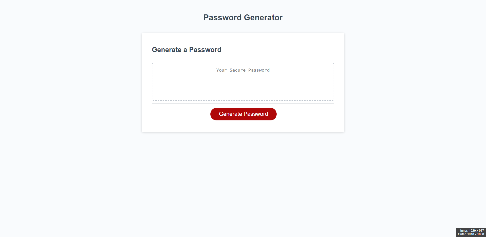

# pw-generator

This is a dynamic password generator.
The application receives user input and based on the user responses generates a unique password to the user.

https://jonjon276.github.io/pw-generator/
